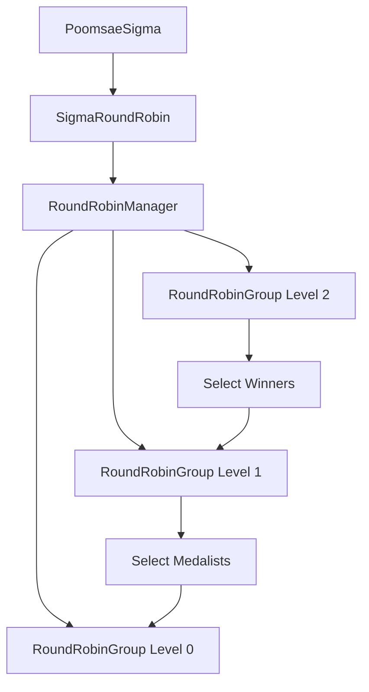

# SigmaRoundRobin Components

Hệ thống components được thiết kế để quản lý giải đấu Round Robin với 3 level tournaments:

## 🏗️ Cấu trúc Components

### 1. `SigmaRoundRobin` (Main Component)
- Component chính được gọi từ `PoomsaeSigma`
- Wrapper cho `RoundRobinManager`
- Props: `players`, `participants`, `content`, `onRefresh`

### 2. `RoundRobinManager` (Tournament Logic)
- Quản lý logic toàn bộ giải đấu
- Xử lý state transitions giữa các phases
- Tự động group players theo levelNode và targetNode
- Phases: Qualifying → Finals → Medals

### 3. `RoundRobinGroup` (Group Display)
- Hiển thị một nhóm players trong một level
- Hỗ trợ selection và advancement logic
- Responsive design với stats tracking

## 🏆 Tournament Structure

### Level 2 - Vòng loại (Qualifying)
- **Nhiều groups**: Theo targetNode (có thể 1-n groups)
- **Nhiều players**: Mỗi group có thể có nhiều VĐV
- **Selection**: Chọn VĐV xuất sắc để lên chung kết (max 8)
- **UI**: Blue theme với grid layout

### Level 1 - Chung kết (Finals)  
- **1 group**: Tối đa 8 VĐV từ vòng loại
- **Selection**: Chọn 3 VĐV cho huy chương
- **UI**: Orange theme với enhanced styling

### Level 0 - Huy chương (Medals)
- **3 positions**: Vàng 🥇, Bạc 🥈, Đồng 🥉
- **Read-only**: Chỉ hiển thị kết quả
- **UI**: Purple theme với medal indicators

## 🎮 User Interactions

### Selection System
```tsx
// Vòng loại: Chọn nhiều VĐV (max 8 for finals)
handleAdvanceFromQualifying(winners: Player[])

// Chung kết: Chọn 3 VĐV cho huy chương  
handleAdvanceFromFinals(medalists: Player[])
```

### State Management
```tsx
tournamentState = {
  qualifyingGroups: Player[][], // Groups từ data
  finalsPlayers: Player[],     // VĐV từ vòng loại
  medalistPlayers: Player[]    // 3 VĐV cuối cùng
}
```

## 🎨 Styling Features

### Responsive Grid
- **Desktop**: Auto-fit columns với min-width
- **Tablet**: Single column layout
- **Mobile**: Compact design với stacked elements

### Medal Styling
```scss
.gold-medal { border: 3px solid #ffd700; }
.silver-medal { border: 3px solid #c0c0c0; }  
.bronze-medal { border: 3px solid #cd7f32; }
```

### Progress Indicator
- Visual progress bar cho 3 phases
- Color-coded states (Blue → Orange → Purple)
- Responsive transitions

## 📊 Data Flow



## 🔧 Usage Examples

### Basic Usage
```tsx
<SigmaRoundRobin
  players={filteredHistories}
  participants={participants}
  content={poomsaeContent}
  onRefresh={handleRefresh}
/>
```

### Advanced Group Management
```tsx
<RoundRobinGroup
  players={groupPlayers}
  groupNumber={1}
  levelNode={2}
  targetNode={targetNode}
  onAdvanceToNext={handleAdvancement}
/>
```

## 🚀 Features

- ✅ 3-level tournament structure
- ✅ Automatic player grouping
- ✅ Interactive selection system
- ✅ Responsive design
- ✅ Progress tracking
- ✅ Medal ceremonies
- ✅ Clean code architecture
- ✅ TypeScript support

## 🔮 Future Enhancements

- [ ] Drag & drop reordering
- [ ] Real-time scoring system
- [ ] Tournament bracket export
- [ ] Match scheduling
- [ ] Statistics tracking
- [ ] Animation transitions